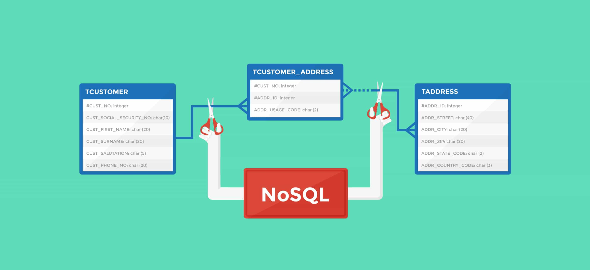



# Requirements

## MongoDB Command File

> - All your files will be interpreted/compiled on Ubuntu 18.04 LTS using MongoDB (version 4.2)
> - All your files should end with a new line
> - The first line of all your files should be a comment: // my comment
> - A README.md file, at the root of the folder of the project, is mandatory
> - The length of your files will be tested using wc

## Task

**0. List all databases**
File: [0-list_databases](0-list_databases/)

**1. Create a database**
File: [1-use_or_create_database](1-use_or_create_database/)

**2. Insert document**
File: [2-insert](2-insert/)

**3. All documents**
File: [3-all](3-all/)

**4. All matches**
File: [4-match](4-match/)

**5. Count**
File: [4-match](4-match/)

**6. Update**
File: [6-update](6-update/)

**7. Delete by match**
File: [7-delete](7-delete/)

**8. List all documents in Python**
File: [8-all.py](8-all.py/)

**9. Insert a document in Python**
File: [9-insert_school.py](9-insert_school.py/)

**10. Change school topics**
File: [10-update_topics.py](10-update_topics.py/)

**11. Where can I learn Python?**
File: [11-schools_by_topic.py](11-schools_by_topic.py/)

**12. Log stats**
File: [12-log_stats.py](12-log_stats.py/)

**13. Regex filter**
File: [100-find](100-find/)

**14. Top students**
File: [101-students.py](101-students.py/)

**15. Log stats - new version**
File: [102-log_stats.py](102-log_stats.py/)