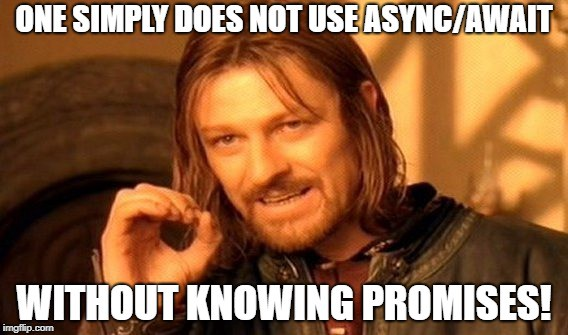



# Requirements

## General

> - All your files will be executed on Ubuntu 18.04 LTS using NodeJS 12.11.x
> - Allowed editors: vi, vim, emacs, Visual Studio Code
> - All your files should end with a new line
> - A README.md file, at the root of the folder of the project, is mandatory
> - Your code should use the js extension
> - Your code will be tested using Jest and the command npm run test
> - Your code will be analyzed using the linter ESLint along with specific rules that we’ll provide
> - All of your functions must be exported

## Setup

## Task

**0. Keep every promise you make and only make promises you can keep**
File: [0-promise.js](0-promise.js/) - [0-main.js](0-main.js/)

**1. Don't make a promise...if you know you can't keep it**
File: [1-promise.js](1-promise.js/) - [1-main.js](1-main.js/)

**2. Catch me if you can!**
File: [2-then.js](2-then.js/) - [2-main.js](2-main.js/)

**3. Handle multiple successful promises**
File: [3-all.js](3-all.js/) - [3-main.js](3-main.js/)

**4. Simple promise**
File: [4-user-promise.js](4-user-promise.js/) - [4-main.js](4-main.js/)

**5. Reject the promises**
File: [5-photo-reject.js](5-photo-reject.js/) - [5-main.js](5-main.js/)

**6. Handle multiple promises**
File: [6-final-user.js](6-final-user.js/) - [6-main.js](6-main.js/)

**7. Load balancer**
File: [7-load_balancer.js](7-load_balancer.js/) - [7-main.js](7-main.js/)

**8. Throw error / try catch**
File: [8-try.js](8-try.js/) - [8-main.js](8-main.js/)

**9. Throw an error**
File: [9-try.js](9-try.js/) - [9-main.js](9-main.js/)

**10. Await / Async**
File: [100-await.js](100-await.js/) - [100-main.js](100-main.js/)