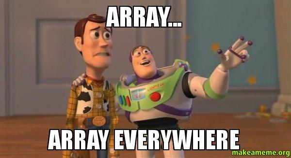

# Requirements

## General

> - All your files will be executed on Ubuntu 18.04 LTS using NodeJS 12.11.x
> - Allowed editors: vi, vim, emacs, Visual Studio Code
> - All your files should end with a new line
> - A README.md file, at the root of the folder of the project, is mandatory
> - Your code should use the js extension
> - Your code will be tested using Jest and the command npm run test
> - Your code will be verified against lint using ESLint
> - Your code needs to pass all the tests and lint. You can verify the entire project running npm run full-test

## Task

**0. Basic list of objects**
File: [0-get_list_students.js](0-get_list_students.js/) - [0-main.js](0-main.js/)

**1. More mapping**
File: [1-get_list_student_ids.js](1-get_list_student_ids.js/) - [1-main.js](1-main.js/)

**2. Filter**
File: [2-get_students_by_loc.js](2-get_students_by_loc.js/) - [2-main.js](2-main.js/)

**3. Reduce**
File: [3-get_ids_sum.js](3-get_ids_sum.js/) - [3-main.js](3-main.js/)

**4. Combine**
File: [4-update_grade_by_city.js](4-update_grade_by_city.js/) - [4-main.js](4-main.js/)

**5. Typed Arrays**
File: [5-typed_arrays.js](5-typed_arrays.js/) - [5-main.js](5-main.js/)

**6. Set data structure**
File: [6-set.js](6-set.js/) - [6-main.js](6-main.js/)

**7. More set data structure**
File: [7-has_array_values.js](7-has_array_values.jss/) - [7-main.js](7-main.js/)

**8. Clean set**
File: [8-clean_set.js](8-clean_set.js/) - [8-main.js](8-main.js/)

**9. Map data structure**
File: [9-groceries_list.js](9-groceries_list.js/) - [9-main.js](9-main.js/)

**10. More map data structure**
File: [10-update_uniq_items.js](10-update_uniq_items.js/) - [10-main.js](10-main.js/)

**11. Weak link data structure**
File: [100-weak.js](100-weak.js/) - [100-main.js](100-main.js/)