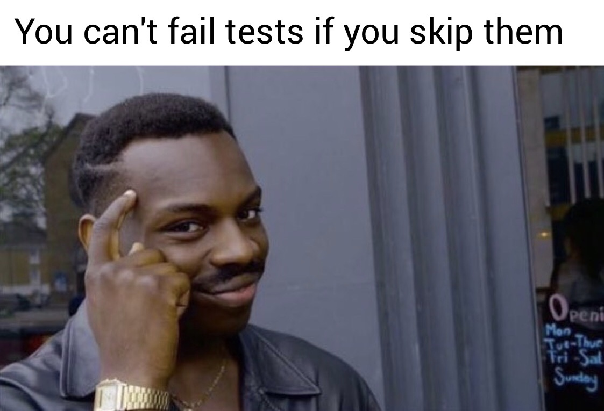



# Requirements

## General

> - All your files will be executed on Ubuntu 18.04 LTS using NodeJS 12.11.x
> - Allowed editors: vi, vim, emacs, Visual Studio Code
> - All your files should end with a new line
> - A README.md file, at the root of the folder of the project, is mandatory
> - Your code should use the js extension
> - Your code will be tested using Jest and the command npm run test
> - When running every test with npm run test *.test.js, everything should pass correctly without any warning or error

## Task

**0. Basic test with Mocha and Node assertion library**
File: [package.json](package.json/) - [0-calcul.js](0-calcul.js/) - [0-calcul.test.js](0-calcul.test.js/)

**1. Combining descriptions**
File: [1-calcul.js](1-calcul.js/) - [1-calcul.test.js](1-calcul.test.js/)

**2. Basic test using Chai assertion library**
File: [2-calcul_chai.js](2-calcul_chai.js/) - [2-calcul_chai.test.js](2-calcul_chai.test.js/)

**3. Spies**
File: [utils.js](utils.js/) - [3-payment.js](3-payment.js/) - [3-payment.test.js](3-payment.test.js/)

**4. Stubs**
File: [4-payment.js](4-payment.js/) - [4-payment.test.js](4-payment.test.js/)

**5. Hooks**
File: [5-payment.js](5-payment.js/) - [5-payment.test.js](5-payment.test.js/)

**6. Async tests with done**
File: [6-payment_token.js](6-payment_token.js/) - [6-payment_token.test.js](6-payment_token.test.js/)

**7. Skip**
File: [7-skip.test.js](7-skip.test.js/) 

**8. Basic Integration testing**
File: [8-api/package.json](8-api/package.json/) - [8-api/api.js](8-api/api.js/) - [8-api/api.test.js](8-api/api.test.js/)

**9. Regex integration testing**
File: [9-api/api.js](9-api/api.js/) - [9-api/api.test.js](9-api/api.test.js/) - [9-api/package.json](9-api/package.json/)

**10. Deep equality & Post integration testing**
File: [10-api/api.js](10-api/api.js/) - [10-api/api.test.js](10-api/api.test.js/) - [10-api/package.json](10-api/package.json/)